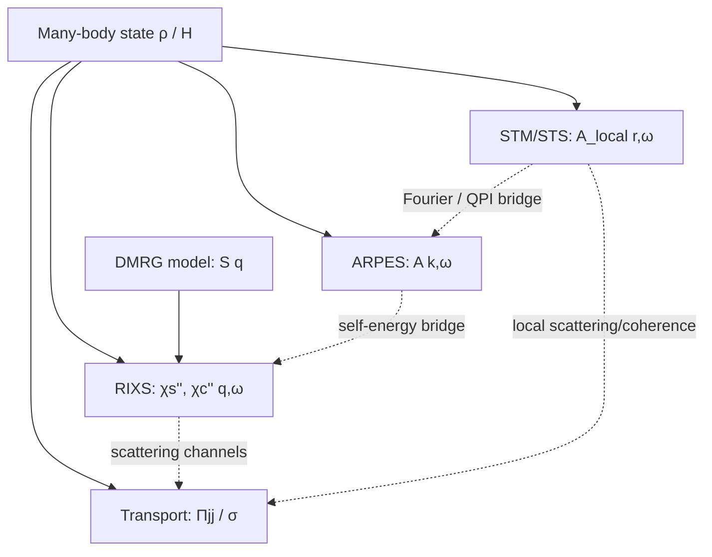

# Cross-WORLD Atlas

## PbBi2201 STM/STS v0.30 × Bi2212 RIXS/DMRG v0.29

### A multi-projection atlas of correlated-electron organization

## Atlas thesis

A physical object is not reconstructed by arithmetically adding unrelated measurements.

```text
An elephant is not:
    4 legs + 2 ears + tail + trunk + back + belly = 10
```

But a coherent description can contain:

- ear width;
- body height;
- leg and tail lengths;
- mutual location of parts;
- constraints on which combinations are physically possible.

The same applies to an electronic many-body state.

```text
STM/STS
    measures local one-particle spectral organization

RIXS
    measures collective momentum-resolved spin/charge organization

ARPES
    measures momentum-resolved one-particle spectral organization

Transport
    measures current response
```

The atlas is therefore a typed geometry of projections, not a scalar sum.

---

# 1. Atlas status

```text
Document type:
    physical cross-WORLD atlas

Direct multimodal fusion:
    NOT AVAILABLE

Physical synthesis:
    FAMILY-LEVEL CANDIDATE

Shared microscopic mechanism:
    WITHHELD

Prediction of untested properties:
    WITHHELD
```

The two source WORLDs correspond to different compounds and samples:

```text
PbBi2201:
    (Pb,Bi)2Sr2CuO6+δ
    STM/STS

Bi2212:
    Bi2Sr2CaCu2O8+δ
    RIXS + DMRG
```

They are compared as projections of correlated cuprate electronic matter, not as measurements of one identical specimen.

---

# 2. Source WORLDs

## WORLD A — PbBi2201 STM/STS representation ecology

Repository:

https://github.com/Alex2704go/pbbi2201-representation-ecology

```text
Repository state:
    ARTIFACT ARCHIVE

Derived/viz:
    PUBLISHED

Raw:
    WITHHELD

Analysis code:
    PENDING

End-to-end replay:
    WITHHELD
```

The archive contains derived tables and visualizations associated with local spectroscopy, temperature evolution, spatial switching and connected topology.

## WORLD B — Bi2212 RIXS/DMRG constrained ecology

Repository:

https://github.com/Alex2704go/bi2212-rixs-constrained-ecology-v0.29

Authoritative source:

https://doi.org/10.5281/zenodo.7286412

```text
Source record:
    VERIFIED

License:
    CC BY 4.0

Raw redistribution:
    NOT USED — DOI reference only

Downstream DER_BINDER claims:
    WITHHELD
```

The source contains spin/charge-resolved RIXS figure data, azimuthal analysis and DMRG `S(q)` arrays.

---

# 3. Underlying physical object

Let `ρ` denote the many-body density matrix and `H` an effective Hamiltonian. No single experiment returns either object directly.

Instead, experiments observe correlators:

```text
Electronic many-body state
    ├── one-particle Green function G
    ├── spin susceptibility χs
    ├── charge susceptibility χc
    ├── current-current correlator Πjj
    └── pair susceptibility χpair
```

A useful complete dossier is therefore:

```text
ElectronicStateDossier = {
    A_local(r,ω,T),
    A_momentum(k,ω,T),
    χs''(q,ω,T,p),
    χc''(q,ω,T,p),
    σ(ω,T,p),
    structure,
    provenance
}
```

The current atlas populates only part of this dossier.

---

# 4. Projection Passports

## Projection P1 — STM/STS

### Approximate observable

```text
dI/dV(r,V) ∝ N(r,ω)
N(r,ω) = -(1/π) Im Gᴿ(r,r;ω)
```

### Native coordinates

```text
r = (x,y)
ω or bias E
T
measurement regime
```

### Physical sensitivity

- local single-particle density of states;
- gap/coherence scales;
- scattering and broadening;
- local doping/disorder landscape;
- nanoscale spectral heterogeneity;
- surface-sensitive electronic structure.

### Strength

Directly localizes where spectra differ in real space.

### Blind spots

- does not directly separate spin and charge channels;
- surface and tunneling matrix elements matter;
- local LDOS alone does not determine collective susceptibility.

## Projection P2 — RIXS

### Approximate observable

```text
I_RIXS(q,ω,polarization)
    → χs''(q,ω), χc''(q,ω)
```

with model- and geometry-dependent matrix elements.

### Native coordinates

```text
q
ω
φ / polarization geometry
doping
spin/charge channel
```

### Physical sensitivity

- collective spin excitations;
- collective charge excitations;
- momentum dispersion;
- spectral-weight redistribution;
- finite-range correlation structure.

### Strength

Separates collective channels in momentum/energy space.

### Blind spots

- illuminated-volume averaging hides local disorder;
- channel disentanglement is model dependent;
- q-space response does not uniquely locate real-space domains.

## Projection P3 — DMRG

### Observable

```text
H_model
    ↓
S(q), Sz(q), related correlators
```

### Coordinates

```text
q
doping/model row
Hamiltonian regime
```

### Strength

Tests whether a specified microscopic model can reproduce selected collective organization.

### Blind spots

- model incompleteness;
- finite size and truncation;
- partial tdouble arrays are not full tdouble;
- agreement in `S(q)` does not guarantee agreement in STM LDOS or transport.

## Missing projection P4 — ARPES

```text
I(k,ω) ∝ |M|² f(ω) A(k,ω)
```

ARPES would provide the one-particle momentum-space bridge between local STM and collective RIXS.

## Missing projection P5 — Transport/optics

```text
σ(ω) ← Πjj
```

Transport would test how available states and collective scattering channels affect actual current flow.

---

# 5. Atlas geometry

## Projection graph



The dashed edges are model-dependent bridges, not automatic identities.

## Typed summed representation

```text
RΣ = (
    R_local,
    R_one-particle-momentum,
    R_collective,
    R_transport,
    R_model,
    BridgeContracts,
    EvidenceStates
)
```

Current occupancy:

| Component | Current source |
|---|---|
| `R_local` | PbBi2201 STM/STS artifact archive |
| `R_one-particle-momentum` | missing ARPES bridge |
| `R_collective` | Bi2212 RIXS source |
| `R_transport` | missing |
| `R_model` | Bi2212 DMRG source |
| `BridgeContracts` | incomplete |
| `EvidenceStates` | explicit in both dossiers |

---

# 6. Shared latent physical parameters

The projections can jointly constrain, but not always uniquely determine:

```text
Δ(r,T,p)      gap/coherence scale
Z(k,r)        quasiparticle residue
Γ(k,r,ω)      broadening/scattering
Σ(k,r,ω)      self-energy
ξs, ξc        spin/charge correlation lengths
Qs, Qc        characteristic momenta
Wspin/Wcharge collective spectral weights
disorder(r)   local potential/doping field
```

The correct inference problem is:

```text
θ = {Δ, Z, Γ, Σ, ξs, ξc, Qs, Qc, disorder, ...}

P(STM, RIXS, ARPES, transport | θ, material, Builder)
```

Because the current measurements concern different materials, a hierarchical model is required:

```text
shared cuprate-family parameters
+
material-specific parameters
    layer count
    Pb substitution
    doping calibration
    disorder
    interlayer coupling
    matrix elements
```

---

# 7. What the two current WORLDs reflect

| Physical aspect | PbBi2201 STM/STS | Bi2212 RIXS/DMRG |
|---|---|---|
| One-particle local states | direct local sensitivity | indirect |
| Collective spin response | not channel-separated | direct RIXS channel |
| Collective charge response | mixed into local spectrum | separated candidate channel |
| Real-space heterogeneity | strong sensitivity | volume averaged |
| Momentum organization | only through Fourier/QPI-type analysis | native q coordinate |
| Thermal evolution | archived multi-temperature organization | not the principal axis of supplied source |
| Doping evolution | local/regime dependent, not fully bridged | explicit UD/OD1/OD2 comparison |
| Theory compatibility | not supplied | DMRG tJ/ttJ/partial-tdouble |
| Disorder sensitivity | high | coarse-grained/averaged |
| Correlation length | spatial domain statistics | q-width-derived candidate |

---

# 8. Physical intersections

## 8.1 Collective fluctuations and single-particle self-energy

STM observes the result of the one-particle self-energy:

```text
G⁻¹(k,ω) = ω - εk - Σ(k,ω)
```

Spin/charge fluctuations observed by RIXS can contribute to scattering channels entering `Σ` and vertex corrections.

Thus:

```text
RIXS constrains available collective scattering channels
STM constrains the local one-particle consequence
Transport constrains the current-carrying consequence
```

No single arrow establishes causality by itself.

## 8.2 Coherence versus collective persistence

STM can show:

- gap filling;
- local loss or redistribution of coherence;
- spatially variable broadening;
- branch switching.

The RIXS source study reports persistent spin excitations into overdoped regimes.

Combined physical hypothesis:

> Strong reorganization of low-energy local quasiparticle coherence can coexist with substantial short-range collective spin correlations.

This rejects a naive implication:

```text
local coherence weakens
    ⇒ all collective spin correlations disappear
```

## 8.3 Real-space domains and q-space correlation lengths

For a genuine response peak:

```text
large Δq ↔ short ξ
small Δq ↔ long ξ
```

Therefore a future bridge can compare:

```text
STM domain/core size distribution
    versus
RIXS spin/charge peak-width correlation lengths
```

However, a maximum theory–experiment residual is not automatically a physical response peak or ordering vector.

## 8.4 Disorder versus collective robustness

STM is strongly sensitive to local doping and disorder. RIXS averages over a larger illuminated region.

A material can therefore show:

```text
strong local LDOS heterogeneity
+
comparatively robust coarse collective response
```

without contradiction.

---

# 9. Cross-WORLD physical Relation Patterns

## XW-RP1 — Persistent collective scaffold with heterogeneous local coherence

```text
collective response remains substantial
while local quasiparticle spectra vary strongly in space/temperature
```

Status: family-level physical hypothesis.

## XW-RP2 — Spectral redistribution rather than binary disappearance

Electronic organization may move between:

```text
coherent local weight
incoherent background
spin response
charge response
transport scattering
```

Status: physically plausible synthesis; quantitative joint fit absent.

## XW-RP3 — Localized burden under different coordinates

```text
STM:
    specific spatial regions carry switching/volatility burden

RIXS/DMRG:
    specific q/channel/model coordinates may carry mismatch burden
```

Status: organizational correspondence. One-to-one physical mapping is WITHHELD.

## XW-RP4 — Projection-dependent anomaly

A state may look anomalous in one correlator and ordinary in another. There is no universal anomaly scalar independent of probe.

---

# 10. Physical conclusions

## Conclusion A — The two probes are complementary

STM answers:

> Where is local single-particle organization heterogeneous?

RIXS answers:

> Where does collective spin/charge response live in momentum and energy?

DMRG asks:

> Which parts of that response are compatible with a chosen Hamiltonian?

## Conclusion B — Persistence is compatible with reorganization

A robust collective background can coexist with local gap filling, broadening and switching.

```text
persistence ≠ uniformity
persistence ≠ immobility
```

## Conclusion C — A binary order/no-order language is insufficient

Temperature and doping may redistribute spectral weight among correlator sectors rather than simply erase organization.

## Conclusion D — The current synthesis constrains model classes

A viable model of the cuprate electron gas should be able to accommodate simultaneously:

- short-range collective spin response;
- nontrivial charge response;
- strongly heterogeneous local spectra;
- temperature-dependent local coherence;
- disorder and material-specific layer effects.

## Conclusion E — The current atlas is not a joint state reconstruction

Because the datasets are unmatched and concern different compounds, the atlas constrains a cuprate-family model class rather than one sample-specific density matrix.

---

# 11. Matched-probe experimental program

A true multimodal reconstruction requires:

```text
same or closely matched material
same doping calibration
overlapping temperature range
common sample provenance
```

and ideally:

1. STM/STS `g(r,E,T)`;
2. Fourier STM/QPI `g(q,E,T)`;
3. RIXS spin/charge `I(q,E,T)`;
4. ARPES `A(k,E,T)`;
5. transport/optics `σ(T,ω)`;
6. structural characterization;
7. common resolution and normalization passports.

## Test 1 — Spatial scale versus collective ξ

Compare STM domain/core sizes with RIXS peak-width-derived correlation lengths.

## Test 2 — Coherence versus spin spectral weight

Compare STM low-energy coherence/gap-filling metrics with integrated RIXS spin response at matched `T,p`.

## Test 3 — Fourier STM versus RIXS q sectors

Compare q-space organizations while explicitly separating quasiparticle-interference vectors from collective excitation momentum.

## Test 4 — Transport closure

Fit STM broadening, RIXS low-energy collective weight and transport scattering within a shared self-energy/vertex model.

---

# 12. Evidence ledger

## PbBi2201

```text
Derived/viz artifacts:
    archived

Raw:
    withheld

Producing code:
    pending

Stage verdict replay:
    not independently reproduced
```

## Bi2212

```text
Zenodo source:
    verified

φ/E/q grammars:
    verified

Theory array shapes:
    verified

Mismatch/curvature/dual-tax claims:
    withheld pending DER_BINDER/scripts
```

## Atlas-level conclusions

```text
Correlator hierarchy:
    physically established framework

Complementarity of probes:
    strong

Family-level persistent-scaffold hypothesis:
    candidate

Shared microscopic mechanism:
    withheld

Predictive joint model:
    not available
```

---

# 13. Interpretation Boundary

## Supports

- a correlator-based physical atlas of STM/STS, RIXS, DMRG, ARPES and transport projections;
- a typed summed representation of the available and missing measurements;
- the family-level hypothesis of robust collective correlations coexisting with heterogeneous local coherence;
- explicit tests for a future matched-probe study.

## Does not support

- arithmetic fusion of unrelated measurements;
- identity of PbBi2201 and Bi2212 electronic states;
- direct causal connection between current STM spatial cores and candidate RIXS mismatch loci;
- one-to-one mapping of QPI vectors to collective RIXS momentum;
- a shared microscopic order;
- a mechanism of superconductivity;
- quantitative transport prediction;
- prediction of untested properties;
- treating archived PbBi2201 verdicts as replayed results;
- treating withheld Bi2212 mismatch claims as source-verified;
- evidence inheritance through vocabulary.

> **Vocabulary correspondence ≠ evidence inheritance.**

---

# 14. Atlas references

- PbBi2201 STM/STS artifact repository:  
  https://github.com/Alex2704go/pbbi2201-representation-ecology

- Bi2212 RIXS/DMRG source-audited dossier:  
  https://github.com/Alex2704go/bi2212-rixs-constrained-ecology-v0.29

- Authoritative Bi2212 RIXS dataset:  
  https://doi.org/10.5281/zenodo.7286412

- General CEOS methodology repository:  
  https://github.com/Alex2704go/Metodology_proposal

<!-- CEOS-INTERPRETATION-BOUNDARY v0.1 -->
## Interpretation Boundary — Document Scope

### Supports

- the protocol, vocabulary, decision history, or document-governance contract explicitly stated here; empirical claims only through separately admitted linked artifacts.

### Does not support

- physical mechanism;
- thermodynamic phase;
- microscopic Hamiltonian;
- causal explanation;
- prediction of untested properties;
- transfer of evidence through vocabulary or Cross Mapping;
- universal validity outside the registered WORLD, sample, protocol, and version;
- empirical validation merely because a rule is documented.

### Cross Mapping Asymmetry

> **Vocabulary correspondence ≠ evidence inheritance.**
